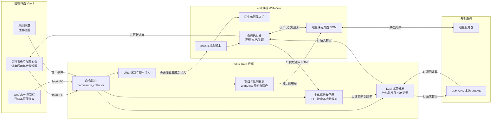

<h1 align="center">uXueScript 2.0</h1>

<p align="center">
  
</p>

<p align="center">
  <strong>学习通自动化辅助桌面客户端</strong><br>
  课程任务自动推进 · 混淆字体还原 · AI 答题参考 · 独立脚本支持
</p>

<p align="center">
  <a href="https://github.com/unraous/uxuescript/releases/latest"></a>
  
  
  
  
  
</p>

<p align="center">
  <a href="https://github.com/unraous/uxuescript/releases/latest">下载最新版本</a> ·
  <a href="docs/usage/desktop.md">桌面端使用</a> ·
  <a href="docs/usage/ai.md">智能答题</a> ·
  <a href="docs/backend-free.md">无后端模式</a> ·
  <a href="docs/architecture/overview.md">架构概览</a> ·
  <a href="https://github.com/unraous/uxuescript/issues">反馈问题</a>
</p>

---

uXueScript 是面向学习通网页版课程的自动化辅助客户端。桌面端基于 **Rust + Tauri 2 + Vue 3** 开发，通过内嵌 WebView 加载课程页面并注入自动化核心脚本，支持在界面中实时同步章节进度；同时内置混淆字体还原与 AI 辅助答题能力，为测验提供参考答案。

项目继承自旧版 [uXuexitongJS](https://github.com/unraous/uxuescript/tree/history)，核心自动化逻辑保留为单文件脚本（`core.js`），支持脱离客户端直接复制到浏览器控制台执行（无后端模式）。

> 当前版本为 `v2.1.4`，处于持续演进与完善阶段。遇到问题建议先更新至最新 Release，并查阅[常见问题解答](docs/troubleshooting.md)。

## 运行预览

<p align="center">
  
</p>

## 核心特性

- **轻量体积：** 基于 Tauri 2 构建，Windows 发行包体积约 `6–7 MB`，无需安装 Python、Selenium 或浏览器驱动。
- **课程任务自动处理：**
  - 自动识别章节目录树与任务点状态，跳过已完成小节，推进未完成任务。
  - 视频任务：支持自动播放、倍速调节、静音与防暂停。
  - 文档任务：支持 PDF 与富文本文档自动滚动触底以完成阅读。
- **混淆字体还原与 AI 答题：**
  - 解析超星 `font-cxsecret` 动态混淆字体，比对 TTF 轮廓特征还原真实题目文本。
  - 支持调用大语言模型生成参考答案，覆盖单选、多选、判断、填空与简答题并自动回填。
- **后台防失焦暂停：**
  - 拦截 `blur`、`visibilitychange` 等页面失焦事件，支持后台挂机运行。
- **双模式运行：**
  - 桌面端：集成 WebView 界面、配置面板与字体/AI 答题后端。
  - 独立脚本：单文件 `core.js`，可直接在任意浏览器控制台运行非测验类任务。

## 运行模式对比

| 功能特性                         |   桌面客户端模式 (Tauri + Vue)    |    独立脚本模式 (`core.js`)    |
| :------------------------------- | :-------------------------------: | :----------------------------: |
| **执行环境**                     |         内嵌桌面 WebView          | 任意现代浏览器控制台 (Console) |
| **环境依赖**                     |     无需额外运行时 (解压即用)     |    需自行登录并手动注入脚本    |
| **视频自动播放 / 静音 / 倍速**   |     支持 (本地配置记忆与锁定)     |  支持 (默认 2.0x 倍速与静音)   |
| **PDF / 文档阅读自动滚动**       |               支持                |              支持              |
| **后台运行 / 失焦防暂停**        |               支持                |              支持              |
| **课程章节自动连续流转**         |               支持                |              支持              |
| **课程章节与任务进度监控**       |       支持 (客户端界面展示)       |     仅浏览器控制台日志输出     |
| **`font-cxsecret` 混淆字体还原** |     支持 (TTF 轮廓与哈希匹配)     |  需后端配合 (独立模式不支持)   |
| **大模型测验参考与自动填答**     |  支持 (多 Provider / 多题型适配)  |  需后端配合 (独立模式不支持)   |
| **登录状态与会话保持**           |       支持 (本地存储持久化)       |    取决于当前浏览器 Cookies    |

> 独立脚本详细执行指引见[无后端模式文档](docs/backend-free.md)。

## 系统架构与工作流程

系统由 **Vue 前端**、**Tauri / Rust 后端**、**内嵌 WebView (`core.js`)** 与 **外部 LLM 服务** 协作构成：



### 核心工作流程：

1. **脚本注入**：课程 WebView 发生页面导航时，后端根据 URL 特征（[`core::url`](file:///Users/plochirm/Workspace/uxuescript/src-tauri/src/core/url.rs)）进行识别；页面加载完成后由 [`core::script`](file:///Users/plochirm/Workspace/uxuescript/src-tauri/src/core/script.rs) 将单文件 [`core.js`](file:///Users/plochirm/Workspace/uxuescript/src-tauri/src/scripts/core.js) 注入到页面。
2. **字体还原**：进入测验任务时，页面抓取包含加密字体的 HTML 传给后端的 [`solve_quiz`](file:///Users/plochirm/Workspace/uxuescript/src-tauri/src/commands/chaoxing.rs)；[`typr.rs`](file:///Users/plochirm/Workspace/uxuescript/src-tauri/src/core/quiz/typr.rs) 解析 TTF 文件的字形轮廓，比对特征哈希表 [`table.json`](file:///Users/plochirm/Workspace/uxuescript/src-tauri/src/core/quiz/table.json) 将混淆字符还原为明文。
3. **题目求解**：明文题目由 [`dispatcher.rs`](file:///Users/plochirm/Workspace/uxuescript/src-tauri/src/core/quiz/llm/dispatcher.rs) 分批（每批 5 题）调用已配置的 LLM 服务，遇到 429 速率限制时根据 `Retry-After` 指数退避重试；解析后的答案返回至页面并自动完成选项点击或内容填入。
4. **进度同步**：自动化脚本中的 `MutationObserver` 检测到任务点完成标记（`ans-job-finished`）后，通过 [`send_status`](file:///Users/plochirm/Workspace/uxuescript/src-tauri/src/commands/chaoxing.rs) 通知后端，后端向主窗口广播 `status-update` 事件以更新界面进度展示。

详细架构说明参见[架构概览文档](docs/architecture/overview.md)。

## 支持的 AI 模型供应商

在桌面客户端 **Configuration** 中支持配置以下供应商及自定义模型：

- DeepSeek
- OpenAI
- Google Gemini
- Moonshot (Kimi)
- 智谱 BigModel
- OpenRouter
- 本地 Ollama

> 详细配置见[智能答题指南](docs/usage/ai.md)。

## 快速开始

### 方式一：直接运行发行包 (推荐)

1. 前往 [Releases 页面](https://github.com/unraous/uxuescript/releases/latest) 下载对应系统的压缩包并解压。
2. 运行 `uxuescript`。
3. 在左侧 **Configuration** 中配置 **Provider**、**Model** 与 **API Key** 并保存（如无需 AI 答题可跳过）。
4. 在右侧内嵌 WebView 中登录学习通，进入目标课程小节。
5. 脚本加载后，点击页面弹出的确认按钮即可开始自动处理。

详细操作与图文流程参见[桌面端使用指南](docs/usage/desktop.md)。

### 方式二：从源码构建

开发与构建前请确保本地具备以下环境：

- [Node.js](https://nodejs.org/) (>= 18) 与 [pnpm](https://pnpm.io/)
- [Rust](https://www.rust-lang.org/) (>= 1.97) 与 Cargo
- 操作系统对应的 [Tauri 2 构建前置依赖](https://v2.tauri.app/start/prerequisites/)

```bash
# 1. 克隆代码仓库
git clone https://github.com/unraous/uxuescript.git
cd uxuescript

# 2. 安装前端依赖
pnpm install --frozen-lockfile

# 3. 启动本地开发环境
pnpm tauri dev

# 4. 构建生产发行包
pnpm tauri build
```

生产打包细节参见[构建指南](docs/development/build.md)。

## 使用须知与边界说明

- **平台支持：** 目前主要在 Windows（x64）环境下测试与验证；macOS 与 Linux 平台的支持处于持续完善中。
- **免责声明：** 本项目仅供个人学习、软件工程研究与自动化技术交流，不对使用本工具造成的任何后果承担责任。请遵守相关使用规范，严禁用于任何违规用途。
- **AI 答题局限：** 模型生成的答题结果受模型自身知识与题目类型限制，仅供参考，无法保证正确率。
- **凭据安全：** API Key 仅保存在本地配置文件中，不会上传至任何第三方云端。

## 文档导航

- [桌面端使用指南](docs/usage/desktop.md)：客户端各项功能、模型配置、课程选项与状态看板。
- [智能答题指南](docs/usage/ai.md)：AI 模型配置、题目提取处理与混淆字体还原技术说明。
- [无后端模式说明](docs/backend-free.md)：如何在任意浏览器的开发者控制台直接执行单文件脚本。
- [架构概览与技术内幕](docs/architecture/overview.md)：前后端通信、WebView 编排与自动化执行链路。
- [常见问题与故障排查](docs/troubleshooting.md)：粘贴限制、网络连接、模型速率限制与常见异常排查。
- [开发与构建指南](docs/development/build.md)：本地开发环境搭建、单元测试运行与各平台分发包构建。

## 反馈与贡献

欢迎提交 Issue 与 Pull Request：

- 遇到问题或页面不兼容，请在 [GitHub Issues](https://github.com/unraous/uxuescript/issues) 提交包含复现步骤、课程类型与控制台日志的反馈。
- 联系邮箱：<unraous@qq.com>。

## 开源许可证

本项目核心源代码依据 [GNU GPL v3.0](LICENSE) 许可证开源发布。  
第三方字体、字形特征哈希表与依赖库声明请参阅 [THIRD_PARTY_NOTICES.md](THIRD_PARTY_NOTICES.md)。
